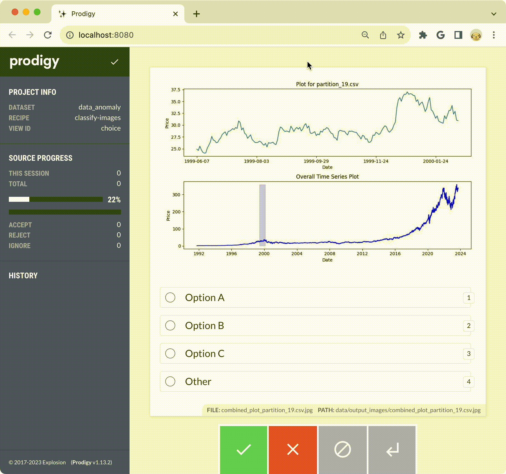

## Getting started

> This is meant to be a dummy demo so the options have generic names. However, this could easily be modified when classifying anomolies in time series for other applications (e.g., temperature data, sales data, energy usage).

Clone the repo

Create a new `venv` with Prodigy:

```
python3.11 -m venv venv
source venv/bin/activate
python -m pip install prodigy -f https://XXXX-XXXX-XXXX-XXXX@download.prodi.gy
pip install -r requirements.txt
```

Run setup steps to generate data and images:
```
(venv) $ make preprocess                
python scripts/preprocessing.py "./data/MSFT.csv" "data/output_files" 176
54 CSV files and statistics file created successfully in data/output_files!
```

```
(venv) $ make get-images
python scripts/generate_plots.py "data/output_files/statistics.jsonl" 0.1 "data/output_files" "data/output_images"
Combined plots saved in data/output_images
```

> This step will filter the partitioned time series to only plot those with a standard deviation larger than 0.1. Another threshold or metric than standard deviation can be used instead.

Run Prodigy:
```
(venv) $ make prodigy-images
```

This will run this Prodigy command:
```
PRODIGY_LOGGING=verbose python -m prodigy classify-images data_anomaly ./data/output_images -F scripts/recipe.py
```



